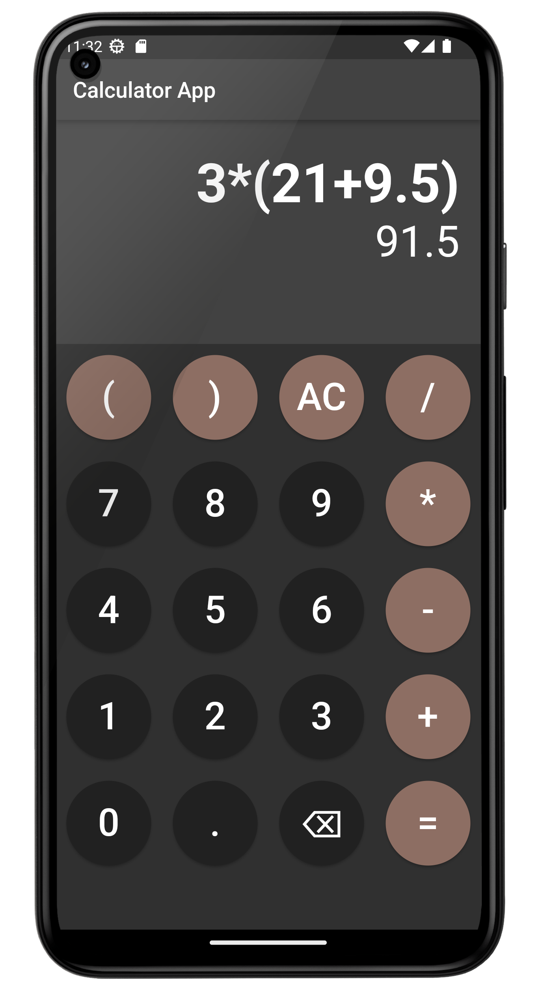

# Anwendungsorientierte Programmierung - Übungsblatt 06

In diesem Übungsblatt sollen Sie eine Taschenrechner-App implementieren.
Ziel dabei ist es, die bereits erlernten Flutter Kenntnisse nochmals zu vertiefen.
Die fertige App soll in etwa so aussehen:



**Hinweis:** Wie immer: Bitte erst das Übungsblatt lesen, bevor Sie mit der Implementierung beginnen. Das Übungsblatt enthält einige Tipps, die Ihnen bei der Implementierung helfen.

Ihnen ist bestimmt aufgefallen, dass das von Ihnen geclonte Git-Repository noch kein Flutter Projekt enthält. Dieses müssen Sie heute selbst anlegen. Dafür gibt es mehrere Möglichkeiten. Die einfachste funktioniert über Visual Studio Code:
- Öffnen Sie die **Command Palette** in Visual Studio Code: `View` -> `Command Palette`
- Im Suchfenster nach `Flutter` suchen und dann auf `Flutter: New Project` klicken. 
- `Application: Empty` auswählen
- Wählen Sie als Zielordner den Ordner des Git-Repositories zum sechsten Übungsblatt aus (`assignment-06-Ihr-GitHub-Nutzername`)


## Voraussetzungen zum Bestehen des Übungsblatts:

- Sie haben einen  Taschenrechner implementiert, 
der über die im Screenshot oben gezeigten 20 Buttons verfügt. Alle Buttons müssen wie zu erwarten funktionieren. Die Berechnungen müssen zudem korrekt sein.
- In einem Text Widget wird die eingegebene Berechnung angezeigt. Ein zweites Text Widget zeigt die Lösung der Berechnung an, sobald auf `=` geklickt wird.
- Falls eine ungültige Eingabe getätigt wurde, soll eine Fehlermeldung im UI angezeigt werden, am besten im Text Widget, in dem sonst der Lösungstext angezeigt wird.
- Ihr Code ist modular geschrieben und sinnvoll kommentiert. Ihr Code ist gut lesbar und enthält keine Code Smells (doppelten Code, etc.).
- Ihren Programmierfortschritt haben Sie durch regelmäßige Commits mit sinnvollen Commit-Messages dokumentiert und den Stand fristgerecht in das Remote-Repository gepusht.


## Tipps zur Implementierung der App:

- Nutzen Sie zur Anzeige der Buttons das GridView Widget:
    ```
    GridView.count(
        crossAxisCount: 4,  // four cells per row in grid
        shrinkWrap: true,  // will prevent "Vertical viewport was given unbounded height." error
        children: createCalculatorButtons(),  // write your own method here to create the buttons. Do not initialize 20 buttons here manually!
    )
    ```
    Mit dem `crossAxisCount` Parameter geben Sie an, wie viele Zellen das Grid pro Zeile haben soll. Der `shrinkWrap` Parameter verhindert, dass Sie die Fehlermeldung `Vertical viewport was given unbounded height.` bekommen.
- Erstellen Sie die 20 Buttons nicht manuell, sondern schreiben Sie geeignete Methoden dafür. Eine Methode kann z.B. einen einzelnen Button erzeugen. Diese soll als Parameter den Text erwarten, den der Button anzeigen soll und gibt ein Widget zurück. Sie können die anzeigenen Button-Texte z.B in einer Liste speichern (`const List<String> buttonTexts = ['(', ')', 'AC', '/', '7', '8', '9', ...]`) und dann mit einer zweiten Methode über diese Liste iterieren und für jedes Listenelement einen Button erzeugen lassen.
- Wenn Sie wie im Screenshot oben runde Buttons wollen, dann verwenden Sie das `ElevatedButton` Widget und fügen Sie in dieses folgenden Codeausschnitt beim `style`-Parameter ein:
    ```
    style: ElevatedButton.styleFrom(
        backgroundColor: buttonColor,
        shape: const CircleBorder(),
    )
    ```
- Wir können uns sehr viel Arbeit sparen, indem wir folgenden Trick anwenden: Speichern Sie die eingegebene Berechnung als String in einer Variable. Den Wert dieser Variable können Sie dann in einem Text Widget im User Interface anzeigen lassen. Sobald der `=` Button gedrückt wird, werten Sie einfach den eingegebenen String der gewünschten Berechnung (z.B. `(3+4)*3`) aus. Dafür können Sie das `math_expressions` Package verwenden. Dieses einfach wieder zu `pubspec.yaml` hinzufügen, `flutter pub get` ausführen und dann das Package in Ihrem Code importieren: `import 'package:math_expressions/math_expressions.dart';`. Dann können Sie mit folgendem Codeausschnitt den String mit der Berechnung auswerten lassen:
    ```
    Parser parser = Parser();
    ContextModel contextModel = ContextModel();
    Expression expression = parser.parse('(3+4)*3');  // Parse the input String
    dynamic result = expression.evaluate(EvaluationType.REAL, contextModel);  // Evaluate the expression
    ```
    Somit müssen Sie sich um die komplette Berechnungslogik nicht kümmern. Die Variable `result` enthält das Ergebnis der Berechnung. Dieses können Sie dann in einem weiteren Text Widget anzeigen lassen
- Kümmern Sie sich an dieser Stelle auch um ein geeignetes Error Handling (try-catch!), da der obige Codeausschnitt bei einer ungültigen Eingabe einen Fehler werfen wird. Den Fehlertext können Sie dann statt der Lösung in dem entsprechenden Text Widget anzeigen lassen.

## Weitere Tipps

- Wenn die im String gespeicherte Berechnung evaluiert wird, wird die Lösung standardmäßig als `double` zurückgegeben. Das bedeutet, dass bei der Eingabe `1+2` als Ergebnis `3.0` statt `3` angezeigt wird. Sie können mit Hilfe des Modulo Operators prüfen, ob eine Gleitkommazahl sich ohne Rest durch eins teilen und sich somit auch als Ganzzahl (Integer) ohne Verlust darstellen lässt:
    ```
    if (result % 1 == 0) {
        result = result.toInt();
    }
    ```
- Wenn Sie auch das Dark Theme in Ihrer App standardmäßig aktivieren wollen, dann fügen Sie folgenden Parameter in das `MaterialApp` Widget ein: `theme: ThemeData.dark(),`
- Die beiden Text Widgets im Beispiel oben werden in einem Container angezeigt. Wenn Sie für ein Element in Flutter eine relative Höhe angeben wollen (z.B. 25% der vorhandenen Höhe), dann können Sie das erreichen, indem Sie im Container Widget den `height` (bzw. `width`) Parameter angeben und mit der `MediaQuery` Klasse die Bildschirmhöhe/-breite abfragen: `height: MediaQuery.of(context).size.height * 0.25,`
- Überlegen Sie sich, wie Sie mit langen Nutzereingaben umgeben wollen. Einfachste aber nicht so schöne Lösung: Sie limitieren die Anzahl der Zeichen, die in den Taschenrechner eingegeben werden können. Schönere, aber auch kniffligere Alternativen: Den Text horizontal scrollbar machen, indem jedes Text Widget in ein `SingleChildScrollView` mit dem Parameter `scrollDirection: Axis.horizontal` gepackt wird; Die Schriftgröße dynamisch reduzieren, wenn eine sehr lange Berechnung eingegeben wurde; ...


## Optionale Erweiterungen:

- Wenn Sie die App auf einem physischen Smartphone testen können, dann können Sie gerne die Funktion einbauen, dass die Buttons des Taschenrechners auch vibrieren, wenn diese gedrückt werden.